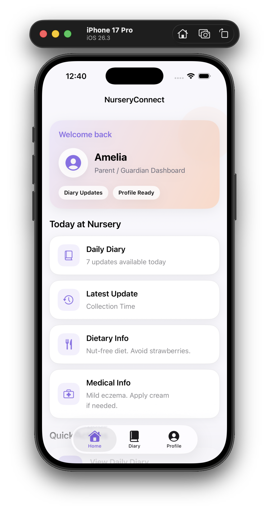
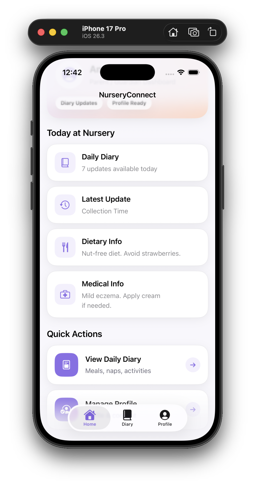
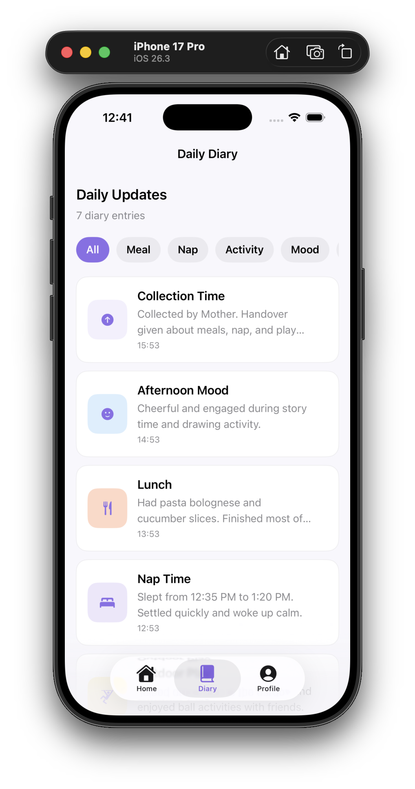
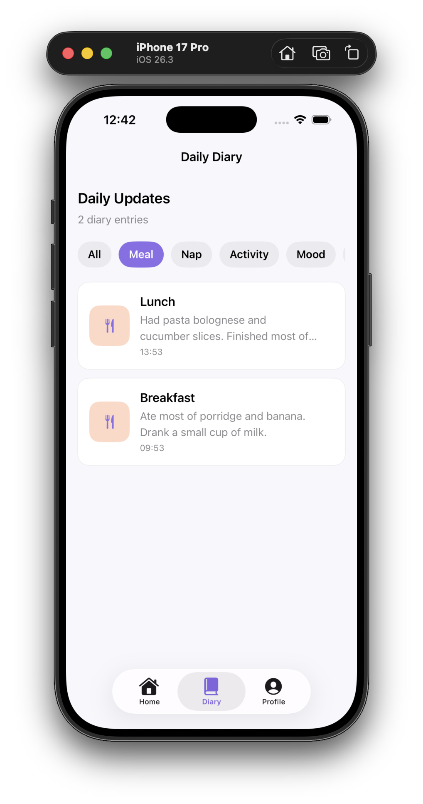
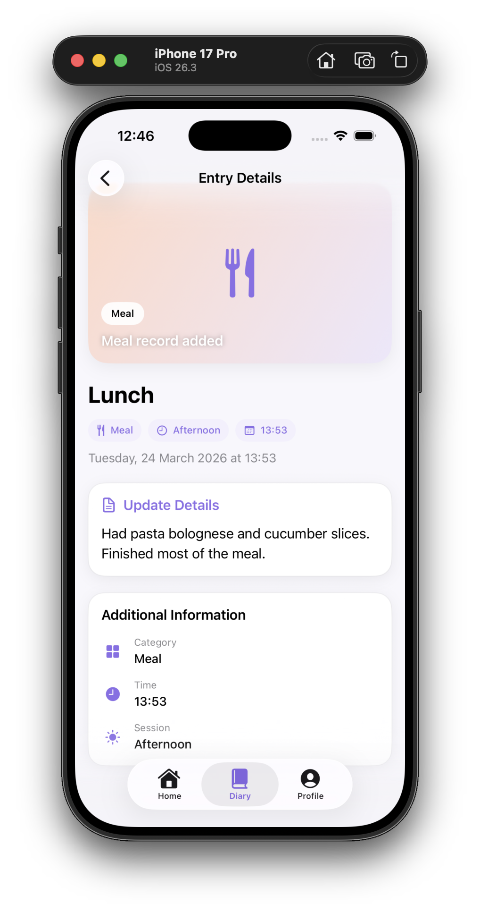
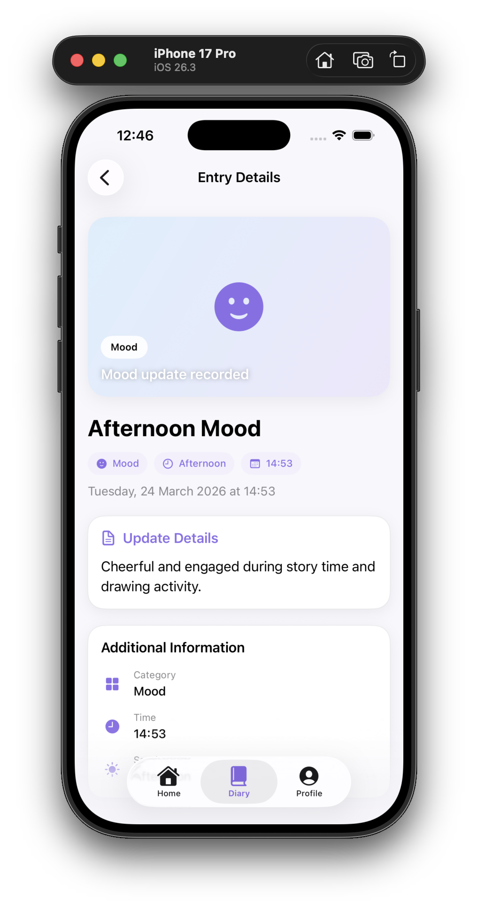
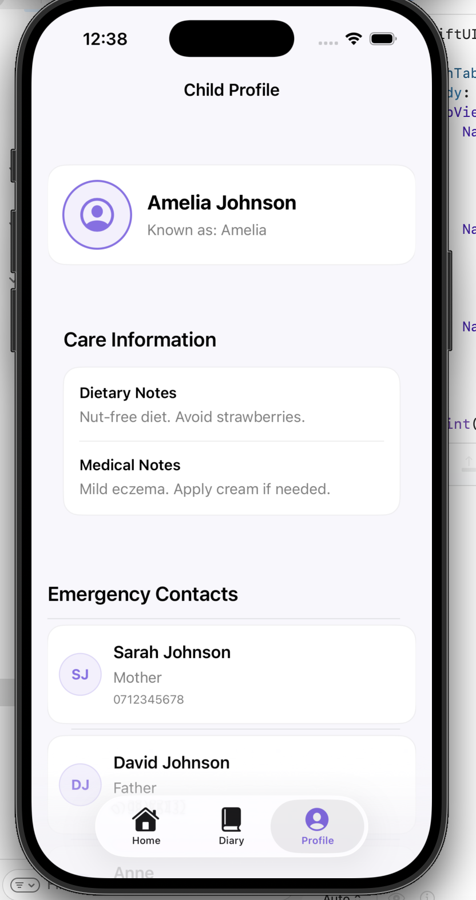
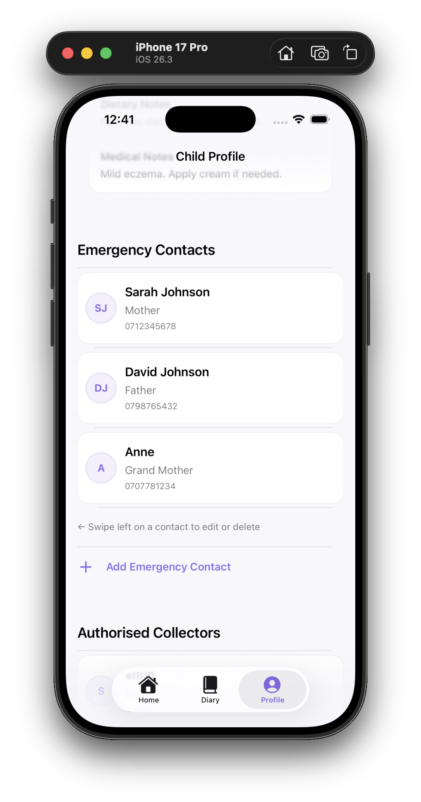
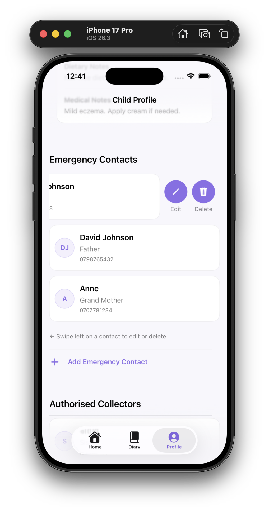
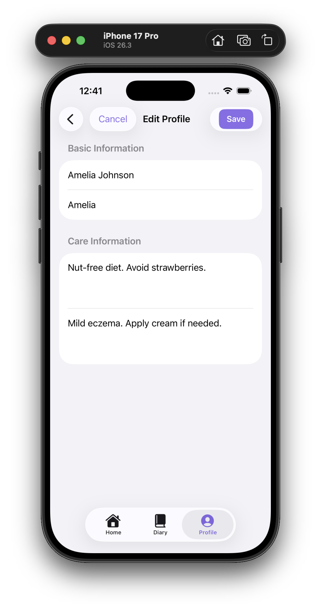

# SE4020 – Mobile Application Design & Development
## Assignment 01 — NurseryConnect iOS MVP

---

## Student Details

| Field | Details |
|---|---|
| **Student ID** | IT22189226 |
| **Student Name** | S N Palamure |
| **Chosen User Role** | Parent / Guardian |
| **Selected Feature 1** | Daily Diary |
| **Selected Feature 2** | Child Profile Management |

---

## 01. Feature Selection & Role Justification

### Chosen User Role

The selected user role for this application is the **Parent / Guardian**.

In a nursery setting, parents are the primary stakeholders who require regular, reliable updates about their child's daily routine, health, and well-being. Traditional methods such as verbal handovers and paper-based reports are inconsistent and easily lost, creating communication gaps that cause parental anxiety and raise safeguarding concerns.

By focusing on this role, the application addresses a real and meaningful need in the NurseryConnect system — giving parents transparent access to their child's daily experience while allowing them to maintain accurate profile and safety information. This role also provides a clear, bounded scope, making it realistic for a four-week MVP development effort.

---

### Selected Features

**Feature 1: Daily Diary**
Allows parents to view structured updates about their child's day including meals, naps, activities, mood, and check-in/check-out events.

**Feature 2: Child Profile Management**
Allows parents to manage their child's profile including emergency contacts, authorised collectors, and consent settings.

---

### Justification

These two features were selected because they are the most essential and complementary pair available to the Parent/Guardian role in the NurseryConnect case study.

The **Daily Diary** directly addresses the core communication problem described in the case study — parents currently have no real-time visibility into their child's day. This feature replaces informal verbal handovers with a structured, persistent, and filterable digital diary. It also maps directly to the EYFS 2024 requirement to maintain accurate welfare and activity records for each child.

The **Child Profile Management** feature addresses the safeguarding obligations described in the Children Act 1989 by ensuring that emergency contact information and authorised collector records are always accurate and accessible. The inclusion of a consent management system directly reflects the UK GDPR requirements for granular, documented parental consent.

Together, these features create a coherent and complete parent-facing experience: parents can both monitor their child's daily life and maintain the safety and consent data that governs their child's care. Both features are implementable without a backend or authentication system, making them well-suited to a four-week MVP scope.

---

## 02. App Functionality

### Overview

The application provides a clean, card-based interface for parents to view diary updates and manage their child's profile information. It launches directly into a dashboard that summarises today's activity and provides quick navigation to both core features.

Data is persisted locally using SwiftData, meaning all records survive app restarts without requiring network connectivity.

---

### Screen Descriptions

**Screen 1 — Dashboard (`DashboardView`)**

The main entry screen. Displays a personalised header card with the child's name, summary cards for today's diary updates, dietary information, and medical notes, and two primary action cards navigating to the diary and profile features. Sample data is seeded automatically on first launch via `SampleData.seedIfNeeded()` so the app is immediately demonstrable.

 


---

**Screen 2 — Daily Diary Screen (`DiaryListView`)**

Displays all diary entries in reverse chronological order. A horizontal filter strip allows parents to narrow entries by type: All, Meal, Nap, Activity, Mood, Check-In, or Check-Out. Entry cards show the title, a short detail preview, the time, and a type-coloured icon. An empty state view is shown when no entries match the selected filter.

  


---

**Screen 3 — Diary Detail Screen (`DiaryDetailView`)**

Shows the full detail of a selected diary entry, including a hero banner, type badges, time period (Morning/Afternoon/Evening), full description text, and an additional information card summarising category, time, and session.

  


---

**Screen 4 — Child Profile Screen (`ProfileView`)**

Displays the child's full profile including their name, preferred name, dietary notes, and medical notes. Separate sections list emergency contacts and authorised collectors, each with inline edit and swipe-to-delete actions. Navigation links lead to Edit Profile and Consent Settings.

 


---

**Screen 5 — Add / Edit Screens**

- `AddEmergencyContactView` — form to add a new emergency contact with name, relationship, and phone number validation
- `EditEmergencyContactView` — pre-populated edit form for an existing emergency contact
- `AddAuthorisedCollectorView` — form to add a new authorised collector with name, relationship, and ID reference
- `EditAuthorisedCollectorView` — pre-populated edit form for an existing collector
- `EditProfileView` — edit the child's name, preferred name, dietary notes, and medical notes
- `ConsentSettingsView` — toggle photography, social media, medical treatment, and GPS tracking consent

 

---

### Navigation

The application uses `NavigationStack` throughout:

```
DashboardView
├── DiaryListView
│   └── DiaryDetailView
└── ProfileView
    ├── AddEmergencyContactView     (sheet)
    ├── EditEmergencyContactView    (sheet)
    ├── AddAuthorisedCollectorView  (sheet)
    ├── EditAuthorisedCollectorView (sheet)
    ├── EditProfileView             (push)
    └── ConsentSettingsView         (push)
```

---

### Data Persistence

The app uses **SwiftData** for local data persistence. The model container is registered in `NurseryAppApp` and includes all five model types:

```swift
.modelContainer(for: [
    ChildProfile.self,
    DiaryEntry.self,
    EmergencyContact.self,
    AuthorisedCollector.self,
    ConsentSettings.self
])
```

SwiftData relationships are configured with `.cascade` delete rules so that removing a child profile automatically removes all associated contacts, collectors, consent settings, and diary entries.

---

### Error Handling

The application handles errors at multiple levels:

- **Input validation** — the `FormValidation` utility class provides `isNotBlank()`, `trimmed()`, and `isValidPhone()` methods used across all add and edit forms
- **Save button state** — all save buttons are disabled while the `isValid` computed property returns false, preventing invalid submissions
- **Alert presentation** — all add and edit views present a validation alert with a specific message when the user attempts to save invalid data
- **SwiftData save errors** — all `context.save()` calls are wrapped in `do/catch` blocks; errors are caught and presented to the user via an alert rather than failing silently
- **Empty state handling** — `ContentUnavailableView` is shown in the diary list when no entries match the current filter, and a styled empty state card is shown in the profile when no contacts or collectors have been added

---

## 03. User Interface Design

### Visual Design

The UI uses a soft purple primary colour (`#8B6FE8`) to convey warmth and trust — appropriate for a professional childcare context. The colour palette is defined centrally in `AppTheme` and referenced across all components, ensuring visual consistency throughout the application.

```swift
enum AppTheme {
    static let primary    = Color(hex: "#8B6FE8")
    static let secondary  = Color(hex: "#EDE7FB")
    static let accent     = Color(hex: "#FFD9C7")
    static let background = Color(hex: "#F8F7FC")
    static let mint       = Color(hex: "#DFF4EA")
    static let peach      = Color(hex: "#FFD9C7")
    static let sky        = Color(hex: "#DCEFFD")
    static let lemon      = Color(hex: "#FFF3C4")
    static let lilac      = Color(hex: "#EDE7FB")
}
```

All screens use a light off-white background (`#F8F7FC`) with white cards, subtle borders, and soft drop shadows to create depth without visual clutter. The dashboard header uses a `LinearGradient` from the secondary lilac to the peach accent, giving the app an approachable and professional appearance.

---

### Usability

- **Card-based layout** — all information is presented in rounded-corner cards with consistent padding, making the interface scannable and easy to read at a glance
- **Type-coloured diary icons** — each diary entry type has a distinct background colour (peach for meals, lilac for naps, lemon for activities, sky for mood) so parents can identify entry types without reading the label
- **Filter chips** — horizontal filter strips in the diary list allow quick filtering without navigating away from the list
- **Disabled save buttons** — save buttons visually dim when the form is invalid, giving immediate feedback that input is required before proceeding
- **Success and error alerts** — all save operations show a confirmation alert on success and a specific error alert on failure, so the parent always knows whether their action worked
- **Slide-in animations** — diary entry cards animate in with a staggered fade-and-offset effect on appear, making the screen feel responsive and polished

---

### UI Components Used

```swift
NavigationStack        // Primary navigation container
ScrollView             // Dashboard and detail screens
LazyVStack             // Diary list for efficient rendering
List                   // Profile screen with section grouping
Form                   // All add and edit screens
TextField              // Text input fields
Toggle                 // Consent settings
Button                 // All interactive actions
NavigationLink         // Push navigation
Sheet                  // Modal add/edit presentations
Alert                  // Validation and confirmation feedback
ContentUnavailableView // Empty state display
```

---

## 04. Swift & SwiftUI Knowledge

### Code Quality

The application is organised into clear, separated layers following an MVVM-influenced architecture:

**Models** — SwiftData `@Model` classes representing core data entities:

```swift
ChildProfile, DiaryEntry, EmergencyContact, AuthorisedCollector, ConsentSettings
```

**Views** — SwiftUI views responsible solely for presenting data and triggering user actions:

```swift
DashboardView, DiaryListView, DiaryDetailView, ProfileView
AddEmergencyContactView, EditEmergencyContactView
AddAuthorisedCollectorView, EditAuthorisedCollectorView
EditProfileView, ConsentSettingsView
```

**Reusable Components** — self-contained view components used across multiple screens:

```swift
DiaryRowCard, ContactRowCard, PrimaryActionCard
SummaryCard, ProfileHeaderCard, SectionHeaderView
InitialsAvatarView, TagChip
```

**ViewModel** — `DiaryViewModel` handles diary filtering logic and count text computation, keeping business logic out of the view layer:

```swift
final class DiaryViewModel: ObservableObject {
    @Published var selectedFilter: DiaryEntryType? = nil

    func filteredEntries(from entries: [DiaryEntry]) -> [DiaryEntry] { ... }
    func timePeriodText(from date: Date) -> String { ... }
    func entryCountText(for entries: [DiaryEntry]) -> String { ... }
}
```

**Utilities** — `FormValidation` provides reusable, stateless validation functions:

```swift
enum FormValidation {
    static func isNotBlank(_ value: String) -> Bool { ... }
    static func trimmed(_ value: String) -> String { ... }
    static func isValidPhone(_ value: String) -> Bool { ... }
}
```

Naming conventions are consistent throughout: types use `UpperCamelCase`, properties and functions use `lowerCamelCase`, and SwiftUI property wrappers (`@State`, `@Query`, `@Bindable`, `@Environment`) are applied correctly to match their purpose.

---

### Code Examples — Best Practices

**Form validation with computed property:**

```swift
private var isValid: Bool {
    FormValidation.isNotBlank(name) &&
    FormValidation.isNotBlank(relationship) &&
    FormValidation.isValidPhone(phoneNumber)
}
```

**SwiftData cascade relationship:**

```swift
@Relationship(deleteRule: .cascade)
var emergencyContacts: [EmergencyContact]
```

**Staggered animation using enumerated index:**

```swift
ForEach(Array(filteredEntries.enumerated()), id: \.element.id) { index, entry in
    DiaryRowCard(entry: entry)
        .opacity(animateCards ? 1 : 0)
        .offset(y: animateCards ? 0 : 12)
        .animation(
            .easeOut(duration: 0.3).delay(Double(index) * 0.04),
            value: animateCards
        )
}
```

**SwiftData-safe deletion:**

```swift
private func deleteEmergencyContact(_ contact: EmergencyContact, from child: ChildProfile) {
    if let index = child.emergencyContacts.firstIndex(where: { $0.id == contact.id }) {
        child.emergencyContacts.remove(at: index)
    }
    context.delete(contact)
    do {
        try context.save()
        contactToDelete = nil
    } catch {
        deleteErrorMessage = "The emergency contact could not be deleted."
        showDeleteErrorAlert = true
    }
}
```

---

### Advanced Concepts

- **SwiftData relationships and cascade delete** — `@Relationship(deleteRule: .cascade)` ensures referential integrity without manual cleanup
- **`@Bindable`** — used in edit views to directly bind SwiftData model properties to form fields with automatic change tracking
- **`@Query` with sort descriptor** — diary entries are always fetched in reverse chronological order: `@Query(sort: \DiaryEntry.timestamp, order: .reverse)`
- **Staggered animations** — entry cards animate in with per-index delay using `.animation(.easeOut(duration: 0.3).delay(Double(index) * 0.04))`
- **`onChange` for animation reset** — the diary filter triggers a card animation reset and replay when the filter selection changes
- **`Binding<Bool>` from optional** — delete confirmation alerts use a custom computed `Binding<Bool>` derived from an optional state variable, avoiding the need for a separate boolean flag

---

## 05. Testing & Debugging

### Unit Tests

Unit tests were written using XCTest to validate the `FormValidation` utility and `DiaryViewModel`, which are the core logic layers shared across all form and diary screens.

```swift
// FormValidationTests.swift

func testIsNotBlank_withValidText_returnsTrue() {
    XCTAssertTrue(FormValidation.isNotBlank("Emma"))
}

func testIsNotBlank_withWhitespaceOnly_returnsFalse() {
    XCTAssertFalse(FormValidation.isNotBlank("   "))
}

func testIsNotBlank_withEmptyString_returnsFalse() {
    XCTAssertFalse(FormValidation.isNotBlank(""))
}

func testTrimmed_removesLeadingAndTrailingSpaces() {
    XCTAssertEqual(FormValidation.trimmed("  Emma  "), "Emma")
}

func testIsValidPhone_withValidUKNumber_returnsTrue() {
    XCTAssertTrue(FormValidation.isValidPhone("07700900123"))
}

func testIsValidPhone_withTooShortNumber_returnsFalse() {
    XCTAssertFalse(FormValidation.isValidPhone("123"))
}

func testIsValidPhone_withTooLongNumber_returnsFalse() {
    XCTAssertFalse(FormValidation.isValidPhone("1234567890123456"))
}

func testIsValidPhone_withNonDigitCharacters_countsDigitsOnly() {
    XCTAssertTrue(FormValidation.isValidPhone("+44 7700 900 123"))
}
```

```swift
// DiaryViewModelTests.swift

func testFilteredEntries_withNilFilter_returnsAllEntries() {
    let vm = DiaryViewModel()
    vm.selectedFilter = nil
    let entries = [mockEntry(.meal), mockEntry(.nap)]
    XCTAssertEqual(vm.filteredEntries(from: entries).count, 2)
}

func testFilteredEntries_withMealFilter_returnsMealOnly() {
    let vm = DiaryViewModel()
    vm.selectedFilter = .meal
    let entries = [mockEntry(.meal), mockEntry(.nap)]
    XCTAssertEqual(vm.filteredEntries(from: entries).count, 1)
    XCTAssertEqual(vm.filteredEntries(from: entries).first?.type, .meal)
}

func testTimePeriodText_morningHour_returnsMorning() {
    let vm = DiaryViewModel()
    var components = Calendar.current.dateComponents([.year, .month, .day], from: Date())
    components.hour = 9
    let date = Calendar.current.date(from: components)!
    XCTAssertEqual(vm.timePeriodText(from: date), "Morning")
}

func testEntryCountText_withZeroEntries_returnsNoDiaryEntries() {
    let vm = DiaryViewModel()
    XCTAssertEqual(vm.entryCountText(for: []), "No diary entries")
}

func testEntryCountText_withOneEntry_returnsSingular() {
    let vm = DiaryViewModel()
    XCTAssertEqual(vm.entryCountText(for: [mockEntry(.meal)]), "1 diary entry")
}
```

---

### UI Tests

UI tests were written to verify navigation and key interactive elements using `XCUIApplication`.

```swift
// NurseryAppUITests.swift

func testDashboardLoads_andDiaryButtonVisible() {
    let app = XCUIApplication()
    app.launch()
    let diaryButton = app.buttons["diaryButton"]
    XCTAssertTrue(diaryButton.waitForExistence(timeout: 5))
}

func testDashboardLoads_andProfileButtonVisible() {
    let app = XCUIApplication()
    app.launch()
    let profileButton = app.buttons["profileButton"]
    XCTAssertTrue(profileButton.waitForExistence(timeout: 5))
}

func testNavigateToDiary_showsDiaryEntries() {
    let app = XCUIApplication()
    app.launch()
    app.buttons["diaryButton"].tap()
    let diaryView = app.navigationBars["Daily Diary"]
    XCTAssertTrue(diaryView.waitForExistence(timeout: 5))
}

func testAddContactButton_opensSheet() {
    let app = XCUIApplication()
    app.launch()
    app.buttons["profileButton"].tap()
    app.buttons["addContactButton"].tap()
    let saveButton = app.buttons["saveButton"]
    XCTAssertTrue(saveButton.waitForExistence(timeout: 5))
}

func testSaveButton_disabledWithEmptyFields() {
    let app = XCUIApplication()
    app.launch()
    app.buttons["profileButton"].tap()
    app.buttons["addContactButton"].tap()
    let saveButton = app.buttons["saveButton"]
    XCTAssertFalse(saveButton.isEnabled)
}
```

---

### Manual Testing

| Scenario | Expected Result | Result |
|---|---|---|
| Launch app with no data | Sample data seeded automatically | ✅ Pass |
| Launch app a second time | Sample data not duplicated | ✅ Pass |
| Tap diary button on dashboard | Navigates to diary list | ✅ Pass |
| Select "Meal" filter chip | Only meal entries shown | ✅ Pass |
| Select "All" filter chip | All entries shown | ✅ Pass |
| Tap a diary entry | Opens detail view with full info | ✅ Pass |
| Tap profile button on dashboard | Navigates to profile | ✅ Pass |
| Tap "Add Emergency Contact" | Sheet opens | ✅ Pass |
| Submit form with empty name | Alert shown, not saved | ✅ Pass |
| Submit form with short phone (3 digits) | Alert shown, not saved | ✅ Pass |
| Submit valid emergency contact | Success alert, contact appears in list | ✅ Pass |
| Swipe left on contact | Edit and Delete actions appear | ✅ Pass |
| Tap Delete on contact | Confirmation alert shown | ✅ Pass |
| Confirm delete | Contact removed from list | ✅ Pass |
| Edit contact, change phone number | Updated value persists after dismissal | ✅ Pass |
| Toggle consent settings, save | Values persist after reopening the screen | ✅ Pass |
| Edit child profile name | Updated name shown on profile header | ✅ Pass |
| Edit profile with blank name | Save button disabled, cannot submit | ✅ Pass |

---

### Debugging

**Bug 1 — SwiftData cascade delete leaving orphaned records**

When `context.delete(contact)` was called without first removing the contact from `child.emergencyContacts`, the relationship array retained a stale reference, causing a crash on the next `@Query` refresh. The fix was to always remove the item from the parent array before calling `context.delete()`, then save:

```swift
child.emergencyContacts.remove(at: index)
context.delete(contact)
try context.save()
```

**Bug 2 — Animation not replaying when filter changed**

When a filter chip was tapped, the staggered animation did not replay because `animateCards` was still `true`. The fix was to set `animateCards = false` inside `onChange`, then re-enable it after a short async delay to allow SwiftUI to register the state change:

```swift
.onChange(of: viewModel.selectedFilter) { _, _ in
    animateCards = false
    DispatchQueue.main.asyncAfter(deadline: .now() + 0.05) {
        animateCards = true
    }
}
```

**Bug 3 — `@Bindable` vs `@State` confusion in edit views**

Initial edit views used `@State` to hold the model object, which meant changes were not tracked by SwiftData until explicitly written back. Replacing with `@Bindable` allowed SwiftData to track property changes through its observation system automatically, simplifying the save logic.

---

## 06. Regulatory Compliance Report

### Understanding of Regulations

#### UK GDPR

The UK GDPR, supplemented by the Data Protection Act 2018, governs all processing of personal data in this application. The app handles two categories of data:

**Personal Data (Article 4):** Child names, preferred names, and emergency contact phone numbers.

**Special Category Data (Article 9):** Medical notes, dietary information, and consent records — all of which relate to a child's health and physical condition.

The lawful basis for processing profile data is **Article 6(1)(b)** — processing necessary for the performance of a childcare contract. The lawful basis for processing medical and dietary information is **Article 9(2)(a)** — explicit parental consent, combined with **Article 9(2)(c)** — processing necessary to protect the vital interests of the child.

The `ConsentSettings` model directly reflects the GDPR requirement for granular consent. Photography, social media sharing, medical treatment, and GPS tracking are stored as four independent boolean fields rather than a single blanket flag, reflecting the requirement that consent must be specific, informed, and freely given for each purpose.

A full production system would additionally require:
- AES-256 encryption at rest for all stored data
- TLS 1.3 for all data in transit to a backend
- A formal Data Protection Impact Assessment (DPIA)
- Appointment of a Data Protection Officer (DPO)
- An automated Right to Erasure (Article 17) workflow
- Version-controlled audit logs of all profile changes with timestamps and user attribution

#### EYFS 2024

The Early Years Foundation Stage statutory framework requires providers to maintain accurate records of each child's welfare, development, and daily activities. The Daily Diary feature directly satisfies this requirement. The `DiaryEntryType` enum covers the key log categories mandated by the framework:

```swift
case meal, nap, activity, mood, checkIn, checkOut
```

The EYFS framework also requires same-day parental notification of all accidents and injuries. The current MVP does not implement push notifications, which is an acknowledged gap. A production system would require a push notification pipeline (such as APNs via Firebase Cloud Messaging) with automated escalation to the Setting Manager if a parent has not acknowledged an incident report within two hours.

#### Ofsted

Ofsted inspectors review safeguarding records, attendance data, and evidence of parental engagement during inspections. The diary feature creates a structured, timestamped log of each child's day that could support an Ofsted inspection. Emergency contacts and authorised collector records provide evidence that safeguarding procedures are in place.

A production system would need exportable, tamper-evident PDF reports and cloud-backed immutable audit trails to fully satisfy Ofsted inspection requirements, as local SwiftData storage is vulnerable to device loss or failure.

#### Children Act 1989

The Children Act 1989 places a duty on providers to safeguard and promote child welfare. The **Authorised Collectors** feature directly implements this obligation — only named, ID-verified adults with a recorded relationship to the child are permitted to collect them. The `AddAuthorisedCollectorView` enforces that all three fields (name, relationship, ID reference) must be completed before saving, and a contextual note in the form explains the safeguarding purpose of the ID reference:

```swift
Text("An ID reference is required for safeguarding. Collectors must show this ID at pick-up.")
    .font(.footnote)
    .foregroundStyle(AppTheme.primary)
```

#### FSA Guidelines

The Food Standards Agency guidelines apply primarily to Catering Staff and are not directly within scope for the Parent/Guardian role. However, the `dietaryNotes` field in `ChildProfile` acknowledges the importance of dietary information being communicated from parents to nursery staff. A full production implementation would include a structured allergen profile linked to the FSA's 14 major allergens rather than a free-text field.

---

### Compliance by Design

The following design decisions directly reflect regulatory requirements:

**Separate consent fields** — `ConsentSettings` stores four independent boolean values rather than a single flag, reflecting UK GDPR's requirement that consent be specific, informed, and granular. Withdrawing social media consent does not affect medical treatment consent.

**Input validation enforced at the UI layer** — all form screens use computed `isValid` properties and disabled save buttons to prevent incomplete or malformed data entering the persistent store. This reflects the GDPR accuracy principle (Article 5(1)(d)).

**Cascade delete relationships** — `@Relationship(deleteRule: .cascade)` ensures that removing a child profile also removes all associated records, supporting the data minimisation and storage limitation principles (Article 5(1)(c) and 5(1)(e)).

**ID reference requirement for collectors** — the authorised collectors form cannot be submitted without an ID reference, directly encoding the safeguarding obligation from the Children Act 1989 into the data entry workflow.

**Acknowledged production gaps:**
- No encryption at rest (SwiftData stores data unencrypted in the iOS app sandbox)
- No audit logging of profile changes
- No push notification system for same-day incident notification
- No cloud backup or data recovery mechanism
- No formal DPIA or DPO designation

---

### Critical Analysis

**Tension 1 — Data Minimisation vs Feature Richness**

UK GDPR Article 5(1)(c) requires that only data necessary for the stated purpose be collected. The MVP uses free-text fields for dietary and medical notes, which could inadvertently capture more health information than is strictly required. A production system would replace free-text fields with structured, coded options — for example, allergen checkboxes from the FSA's 14 major allergens list — to enforce data minimisation at the point of entry rather than relying on users to self-limit.

**Tension 2 — Local Persistence vs Compliance**

SwiftData stores all data unencrypted in the iOS app sandbox. While iOS sandboxing provides some protection, this does not meet the GDPR requirement for appropriate technical security measures (Article 5(1)(f)) in a scenario where a device is lost or accessed without authorisation. The mitigation in a production system would be to store all sensitive data in an encrypted cloud backend and treat the app as a thin client that holds no persistent data locally, requiring authenticated access to retrieve any personal data.

**Tension 3 — Consent Friction vs Usability**

The four-toggle consent screen adds friction to the parent onboarding experience. However, this friction is non-negotiable under UK GDPR Article 9 — explicit, granular consent for Special Category Data cannot be obtained through a single checkbox. A thoughtful mitigation would be to present consent collection as part of a guided onboarding flow with plain English explanations at each step, reducing perceived friction while maintaining full legal compliance.

**Tension 4 — Authorised Collector ID vs Accessibility**

Requiring an ID reference for every authorised collector is important for safeguarding but may create a barrier for parents who wish to add a collector quickly. The production system described in the case study envisions confirmation via physical photo ID at the nursery door — the ID reference stored in the app is a pre-registration of the expected ID, not a real-time verification mechanism. This distinction should be clearly communicated to parents in the UI to avoid confusion.

---

## 07. Documentation

### (a) Design Choices

**Colour scheme:** The primary purple (`#8B6FE8`) was chosen to feel warm, modern, and trustworthy without being clinical. Purple is commonly associated with creativity and care, appropriate for a professional childcare application. The secondary palette (lilac, peach, mint, sky, lemon) provides a soft, friendly range of accent colours used for diary entry type icons, creating an instantly recognisable visual language without requiring parents to read labels.

**Card-based layout:** All information is presented in rounded-corner cards rather than plain list rows. This improves scannability for parents checking updates quickly on a mobile device and provides clear visual grouping for related information.

**`NavigationStack` over `TabView`:** A navigation stack was chosen to reflect the task-flow nature of the app. Parents move through a hierarchy of screens with clear back navigation rather than switching between independent modes. This aligns with how the Parent/Guardian role is described in the case study — primarily read-focused with occasional write actions.

**Component library approach:** Reusable components (`SummaryCard`, `PrimaryActionCard`, `DiaryRowCard`, `ContactRowCard`, `InitialsAvatarView`, `SectionHeaderView`, `TagChip`) were designed upfront to ensure visual consistency across all screens. This reduced development time and made it easy to iterate on the design without modifying individual screen files.

**`AppTheme` enum:** All colours are defined in a single `AppTheme` enum rather than inline, making it straightforward to update the visual design across the entire application in one place.

---

### (b) Implementation Decisions

**SwiftData over CoreData:** SwiftData was chosen because it is the modern, Swift-native persistence framework introduced in iOS 17. It provides a significantly simpler API than CoreData — model classes are defined with the `@Model` macro, relationships with `@Relationship`, and queries with `@Query` — eliminating boilerplate and making the persistence layer easy to understand and maintain. No third-party libraries were used in this project.

**Sample data seeding:** A `SampleData.seedIfNeeded()` function seeds realistic diary entries and a child profile on first launch, making the app immediately demonstrable without requiring manual data entry. It checks whether profiles and entries already exist before seeding to prevent duplication on subsequent launches.

**`DiaryViewModel` as `ObservableObject`:** Although SwiftData's `@Query` handles data fetching, filter state and derived text computations were extracted into a `DiaryViewModel` to keep the view layer free of business logic. This demonstrates MVVM awareness and improves testability — the view model can be unit tested independently of any SwiftUI view.

**MVP simplifications acknowledged:**
- No user authentication (prohibited by the assignment brief)
- No push notifications or real-time updates
- No cloud backend or API integration
- No in-app camera or photo pipeline
- Sample data used in place of real nursery staff input

---

### (c) Challenges

**Challenge 1 — SwiftData relationship deletion order**

When implementing swipe-to-delete for emergency contacts, the initial approach called `context.delete(contact)` directly. This left a stale reference in `child.emergencyContacts`, causing a crash on the next SwiftData `@Query` refresh. The fix required understanding that SwiftData's observation system needs the parent array to be updated before the context is asked to delete the child object. This was resolved by always removing the item from the parent array first, then deleting from context, then saving.

**Challenge 2 — Edit view state initialisation with `@Bindable`**

When building the edit views, the initial approach used `@State` to hold copies of the model's properties. This meant changes were not tracked by SwiftData until explicitly written back. Switching to `@Bindable` resolved this by allowing SwiftData's observation system to track changes to the model's properties directly. The key learning was understanding when to use `@State` (for transient local UI state such as alert flags) versus `@Bindable` (for direct model property binding).

**Challenge 3 — Consistent UI across heterogeneous data**

The diary list needed to display six different entry types with distinct icons and colours while using a single `DiaryRowCard` component. This was resolved by creating `icon(for:)` and `backgroundColor(for:)` helper functions inside the card component that switch on the `DiaryEntryType` enum, keeping all type-specific presentation logic in one place and making it easy to add new types in the future.

---

## 08. Reflection

### What went well?

The component library approach was the most successful aspect of the project. By designing `SummaryCard`, `PrimaryActionCard`, `DiaryRowCard`, and the other reusable components early, building each subsequent screen was straightforward — screens are composed of existing components rather than built from scratch. This also ensured visual consistency without revisiting styling decisions on every screen.

The `AppTheme` enum was similarly effective. Having a single source of truth for all colours meant the design could be adjusted globally without touching individual files.

---

### What would you do differently?

**Plan SwiftData relationships upfront.** The cascade delete issue caused rework that could have been avoided had the relationship model and deletion workflow been sketched out before writing view code. In future, the data model and its constraints should be finalised before building any UI.

**Write unit tests earlier.** Tests for `FormValidation` and `DiaryViewModel` were written towards the end of development. Writing them earlier would have caught the phone validation edge case (strings containing non-digit characters such as `+44 7700 900 123`) sooner and would have provided a safety net during view refactoring.

**Apply a more consistent MVVM pattern.** The `DiaryViewModel` is effective, but profile-related logic such as deletion and alert state management remains in the view. A `ProfileViewModel` would have improved separation of concerns and made `ProfileView` less complex.

---

### AI Tool Usage

This project was developed with assistance from Claude (Anthropic). The AI was used to assist with the following aspects:

- Structuring the SwiftData model layer including relationship configurations and cascade delete rules
- Writing the reusable component library (`SummaryCard`, `PrimaryActionCard`, `DiaryRowCard`, etc.)
- Implementing form validation logic in `FormValidation`
- Designing the `AppTheme` colour system
- Writing the dashboard `DashboardView` with gradient header and summary cards
- Writing all add and edit form views with proper validation and alert handling
- Structuring and writing this report according to the assignment template

All code was reviewed, understood, and tested by the student. The student is able to explain all implementation details, design decisions, and code during the viva.

---

*SE4020 — Mobile Application Design & Development | Semester 1, 2026 | SLIIT*
